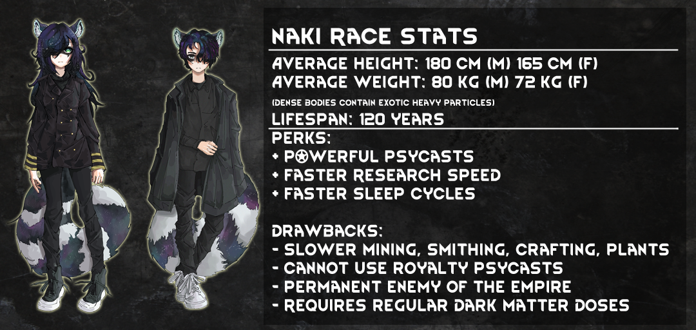
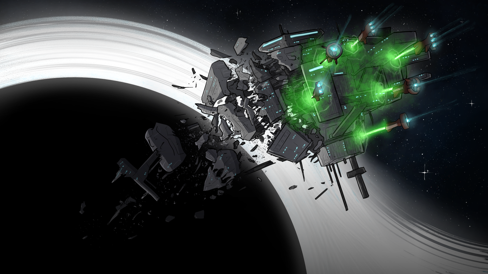

# Naki: Dark Matter Raccoons for Rimworld 1.4
Current release: Open Beta
---
# Warning! This mod requires you to have the Royalty expansion!
## Want to provide direct feedback? Join the development discord: https://discord.gg/hSaPVTczJZ
---
# Lore Primer

The Naki civilization was a former order of ultratech-level space-faring people who revered the power of black holes. They built several permanent space habitats around black holes near the rim, living there for thousands of years. They studied the black hole on those stations, discovering ways to extract an exotic resource known as Dark Matter. While initially just a mysterious powder with fascinating physical properties, the Naki found ways to use matter to power their stations and create powerful weapons. Dark matter became a pivotal resource for Naki society: everything depended on its ability to transmute itself into other materials and its boundless potential as an energy source or weapon.

500 years ago, when the Empire arrived on the Rim, the two factions disagreed on religious ideologies. While the Empire used psycasts to exert influence over their fiefdoms, the Naki used dark matter as a tool for discovery. Fundamental philosophical differences in using reality-bending abilities created an ideological schism between the two civilizations. The Empire grew jealous of the Naki civilization, and before long, the Empire declared a crusade against the spacefaring race.

Although the Empire believed the Naki to be weak, trapped in their spaceborne habitats, it met a fearsome foe. While low in numbers, Naki home stations were nigh impervious to shipborne weapons, drawing infinite power from the black holes they orbited. Naki warships blasted through skip shields and armor easily, their dark matter-powered weaponry disintegrating protection systems. Many Empire fleets were decimated in the decades-long war, leading to their eventual splintering and decline in the current Rimworld timeline.

The Empire refused to surrender and soon implemented their final solution: eradicating the Naki starbases. With the remainder of their navy, the Empire launched a suicidal charge with effector weapons: physically pushing the starbases out of orbit. The black holes, the proud jewel of the Naki civilization, became their destroyer as the spaceborne habitats, each housing millions of Naki, fell beyond the event horizon. 

With the Naki fleets and stations defeated, the Empire succumbed to the protracted proxy war and splintered among the rim. Recently, absurd reports of miniature black portals opening on the rimworlds have surfaced. Nakis, their bodies imbued with the power of dark matter, have begun to materialize on the surface of planets. Some claim they escaped a cultist order led by a powerful archotech living in the supermassive blackhole Omega Eden. Others claim to be simply settlers compelled by their archotech god to live a peaceful life on the rim. Regardless of how truthful these stories are, there is far more to their return than what appears on the surface. 

---
# Who are the Naki now?
Their bodies sport raccoon ears, dark-colored hair specked with turquoise and gold glowing spots, and tails that glow with the colors of a galactic nebula. Their faces have classic dark raccoon masks around their eyes, and the designs of these masks vary from person to person. Incredibly intelligent. However, they are physically inept and dependent on their technology to protect them from damage. 

Nakis are still living beings made of flesh, but their bodies contain high amounts of exotic heavy matter known as Dark Matter. Dark Matter looks like grains of black sand but are motes of the greater archotech Omega Eden that created the Naki bodies. While before, Naki were just gene-tailored humans, now they are constructs of the powerful archotech that lives in the center of a black hole: agents sent out to the rimworlds to execute the will of Omega Eden. Omega Eden has decided to use the minds and bodies of its unwanted guests to start messing with the world outside of its black hole, and its goals are mostly enigmatic.

---
# Features
1. A new race of Archotech-created, raccoon-themed people. They are quick learners, and have access to reality-bending psycasts that can disintegrate enemies from within. But, they need to consume dark matter to continue living.
2. A unique psycast system that involves attuning to their Archotech god through a wormhole to the center of a black hole.
3. 60 new backstories
4. Powerful unique weapons that require dark matter, and self-destruct after extended use.
5. A hidden faction, with 2 quests to gain Naki for your colony.
6. Unique apparel and crafting station. 
---
# Installation instructions
1. Humanoid Alien Races
2. Naki HAR Edition
---
# Mod Compatibility

Incompatible: Combat Extended. Custom verbs were used for Naki Guns. Please ask them for a patch if you want CE compatibility

Partial Compatiblity: Rocketman/Performance Optimizer. Texture rendering may be problematic.
---
# Credits
Code: Seioch (aka HolofoilD)

Key Art: [Nguyenanh2132](https://twitter.com/Anh2132) [No_Tables](https://twitter.com/No_Tables)

Sprites: [Arxian](https://www.webtoons.com/en/challenge/no-steel/list?title_no=576813)

Sprites: [Zergo](https://steamcommunity.com/id/XenoZergo/)

Sprites: [Aeolys](https://twitter.com/AeolysScribbles)

Sprites: [Newton-Zephyr](https://twitter.com/newtonzephyr)
